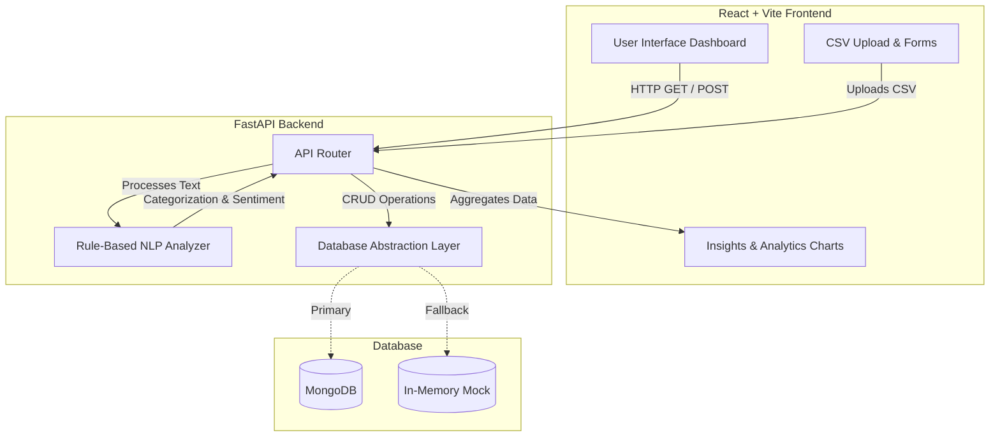
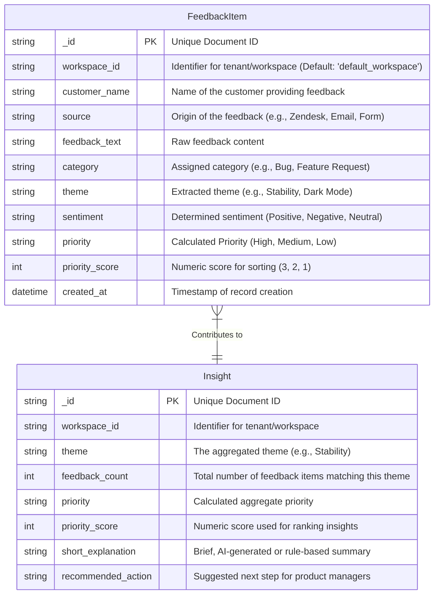

# ProductPulse AI Architecture & Database Schema

## System Architecture

The application follows a modern client-server architecture, utilizing a React frontend (Vite) and a FastAPI backend, connected to a MongoDB database.

> [!NOTE]
> The backend defaults to an in-memory mock database if MongoDB is not provided in the environment variables, ensuring the application can always run locally out of the box.

---

## Database Schema

The database stores raw and processed feedback items, as well as aggregated insights. The data is modeled using Pydantic in `backend/models.py`.

